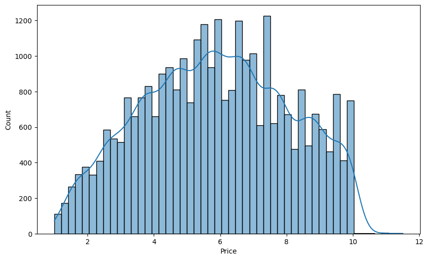
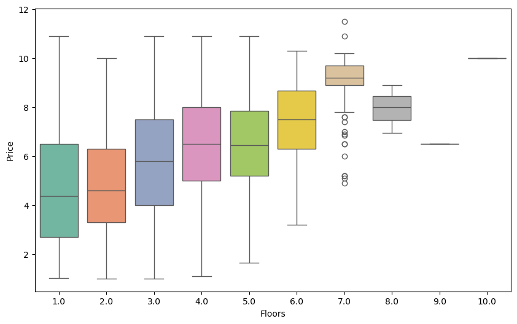
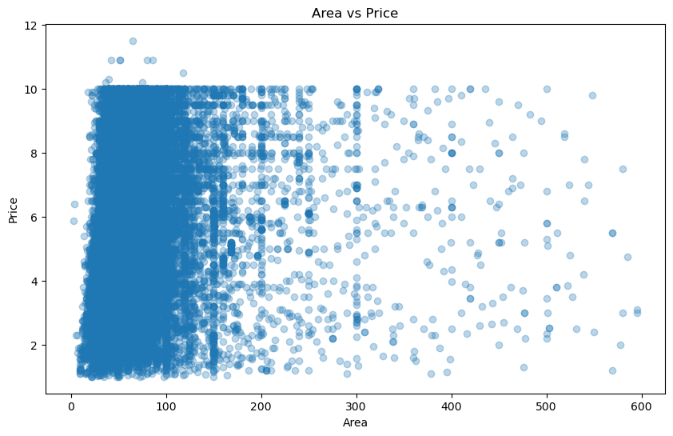
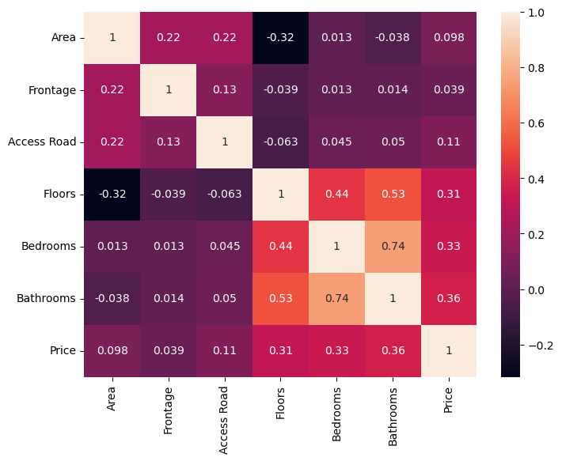
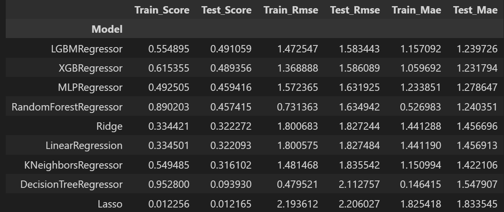

# Vietnam Property Price Analysis & Prediction

## Table of Contents
- [Project Overview](#-project-overview)
- [Dataset](#-dataset)
- [Methodology](#-methodology)
- [Results](#-results)
- [License](#-license)
- [Contact](#-contact)

## Project Overview

This project analyzes Vietnam's real estate market through:
- Comprehensive data cleaning and preprocessing
- Detailed exploratory data analysis (EDA)
- Machine learning model implementation
- Price prediction capabilities

## Dataset

**Source**: Web-scraped from [batdongsan.vn](https://batdongsan.vn)  
**Size**: 30,229 property listings  
**Features**: 12 attributes

## Methodology 
Data Pipeline
Data Collection → 2. Cleaning → 3. EDA → 4. Feature Engineering → 5. Modeling → 6. Evaluation

Models Implemented
- Linear Regression
- Decision Trees
- Random Forest
- XGBoost
- Neural Networks (MLP)
- K-Nearest Neighbors
  
Evaluation Metrics
- R² Score
- Root Mean Squared Error (RMSE)
- Mean Absolute Error (MAE)

## Result 

Here are some sample of findings:
 

## Contact
For questions or suggestions:

Maintainer: Duong Quang Thanh

Project Link: [https://github.com/yourusername/vietnam-property-analysis](https://github.com/doupeter17/Vietnam-Property-Analysis)

Issue Tracker: GitHub Issues
